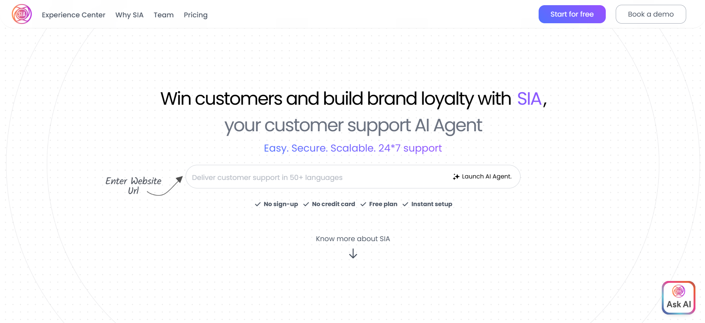

## Introduction

Welcome to SIA! This guide will walk you through the essential steps to begin your journey, including account creation, initial setup, and navigating the dashboard. Follow these steps to get started quickly and efficiently.
    <Frame>
        
    </Frame>

## Account Creation

<AccordionGroup>
  <Accordion icon="user-plus" title="Sign Up Process">
    1. Visit [scogo.ai](https://scogo.ai)
    2. Click on "Start for free" or "Create Account"
    3. Choose your preferred signup method:
    
        
    
       - Fill the Sign up form and click on Create Account
       - Click on "Sign up with Google" for quick signup 
       - Click on "Microsoft" for quick signup
       - Click on "Apple" for quick signup  
  </Accordion>
  
  <Accordion icon="arrow-right-to-bracket" title="Login Process">
    If you are already a registered user:
    
    1. Navigate to the login page
    2. Enter your credentials
    3. Click "Sign In" to access your dashboard
  </Accordion>

  <Accordion icon="circle-check" title="Post-Signup Experience">
    Upon successful signup:
    - You'll be automatically redirected to the dashboard
    - A welcome screen will guide you through initial setup
    - You'll receive a confirmation email
  </Accordion>
</AccordionGroup>

## Onboarding

{/* <CardGroup> */}
  <Card title="Welcome Screen" icon="hand-wave">
  <Frame>
    
  </Frame>
    Your first login presents a welcome screen that:
    - Introduces key platform features
    - Outlines the next steps
    - Provides quick access to essential resources
  </Card>

  <Card title="Basic Setup" icon="gear">
    Complete these initial steps to get started:
    - Verify your email address
    - Set up your profile information
    - Configure basic preferences
  </Card>
{/* </CardGroup> */}

<Note>
  Need help? Our support team is available to assist you with any questions during your setup process.
</Note> 